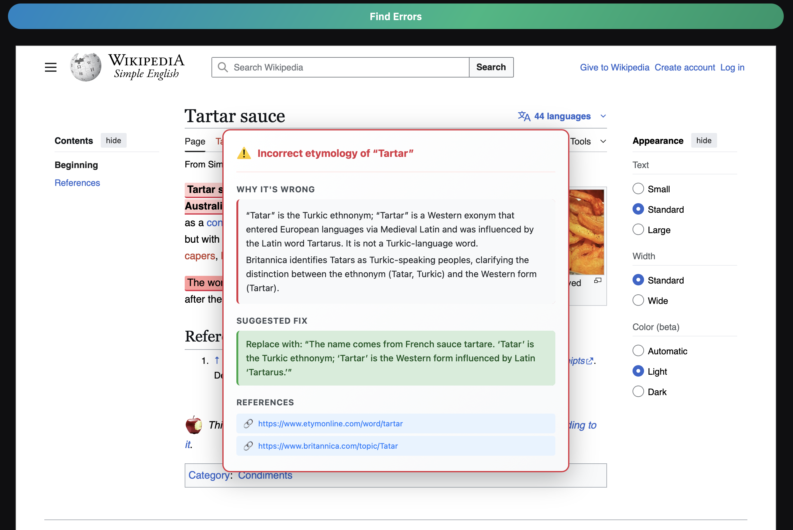
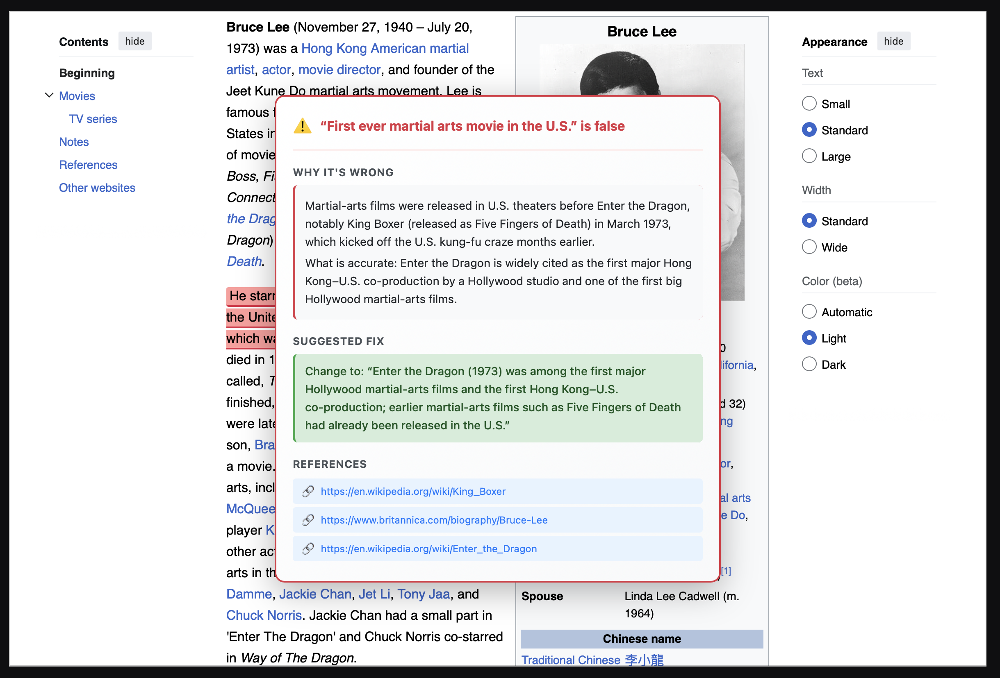
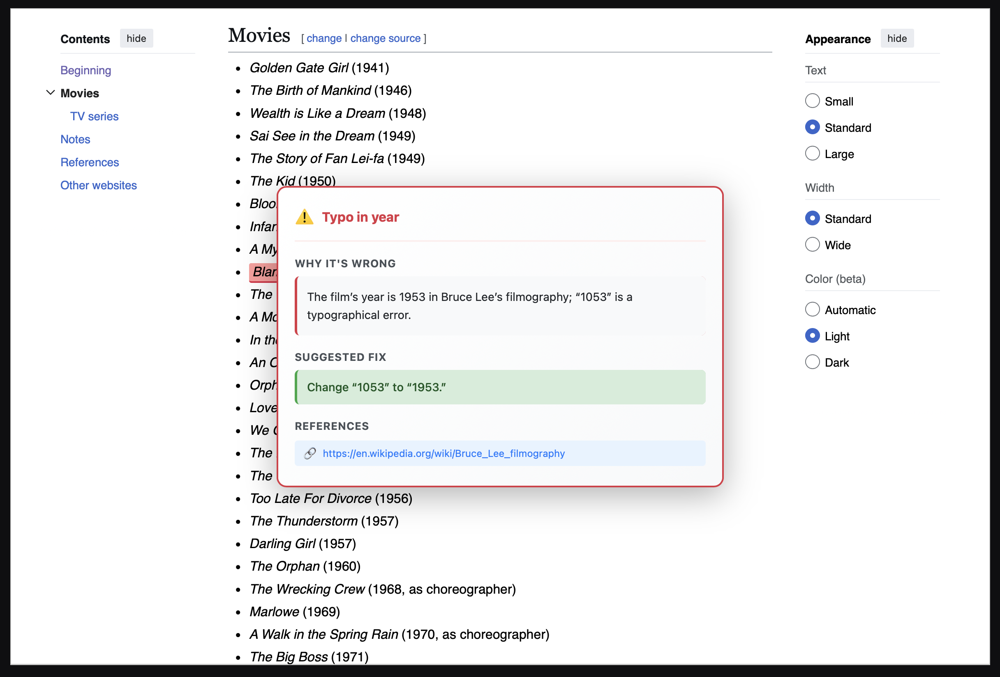
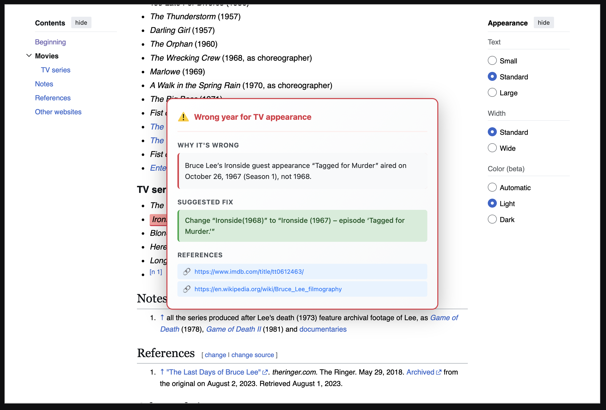

# CuraData
### Find errors and cure your data

Input web page with your information (e.g. Wikipedia page)
or table data (csv) and get a list of potential errors with analysis

## YouTube Demo
[](https://www.youtube.com/watch?v=93nSd0prUUE)

## Demos
|     |  |
|-----------------------------|-----------------------------|
|  |  |

## Prerequisites
1. OpenAI developer account
2. Weaviate developer account
3. [uv](https://docs.astral.sh/uv/) python package and project manager

## Installation

1. Clone the repository:
   ```bash
   git clone https://github.com/VladKha/cura-data.git
   cd cura-data
   ```
2. Install [uv](https://docs.astral.sh/uv/getting-started/installation/)

3. Install dependencies:
   ```bash
   uv venv
   uv sync
   ```

## Environment Variables
Create a `.env` file in the root directory from `.env_example` file 
and add all required environment variables:
- `OPENAI_API_KEY` from your OpenAI developer account
- `WEAVIATE_URL`, `WEAVIATE_API_KEY` from your [Weaviate sandbox cluster](https://docs.weaviate.io/cloud/manage-clusters/create#sandbox-clusters)

## How to Run
Run the agent: `python gradio_demo.py`

## Technologies
- OpenAI GPT-5: LLM for agent "brains"
- Lovable: UI design, [mock](https://page-probe-project.lovable.app)
- Weaviate: persistent storage of table datasets with [agentic enrichment](https://docs.weaviate.io/agents/transformation/tutorial-enrich-dataset) (translate to German)
- Python 3.12
- uv: package manager
- Gradio: demo UI
- instructor: LLM structured output

## Relevant works
1. `EMNLP 2025 (Main) paper: "Detecting Corpus-Level Knowledge Inconsistencies in Wikipedia with LLMs."` ([X post](https://x.com/sina_semnani/status/1975994117579821345), [Arxiv](https://arxiv.org/abs/2509.23233), [GitHub](https://github.com/stanford-oval/inconsistency-detection))